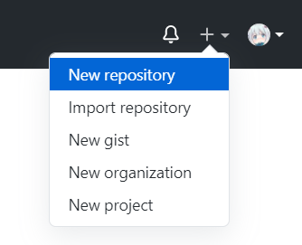
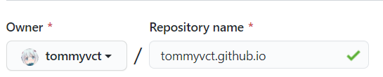
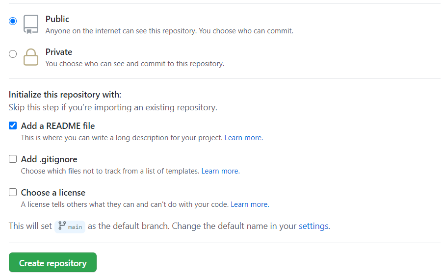
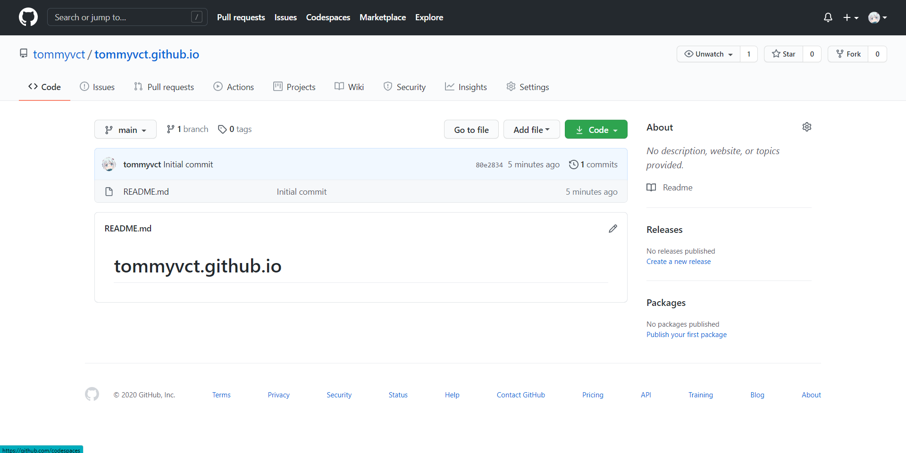
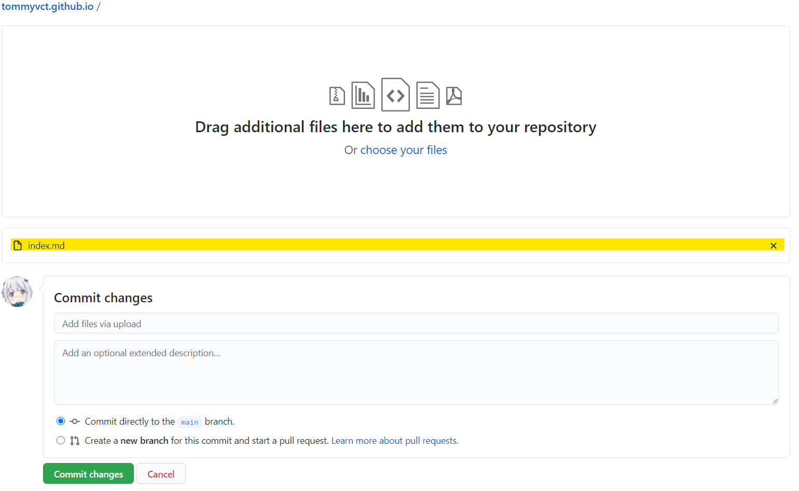
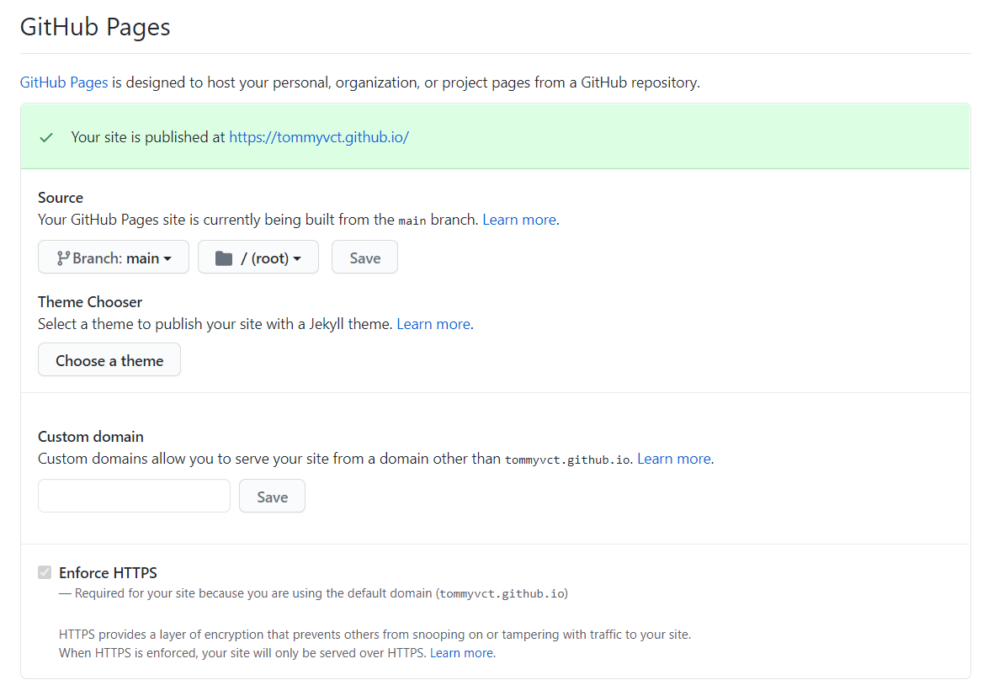
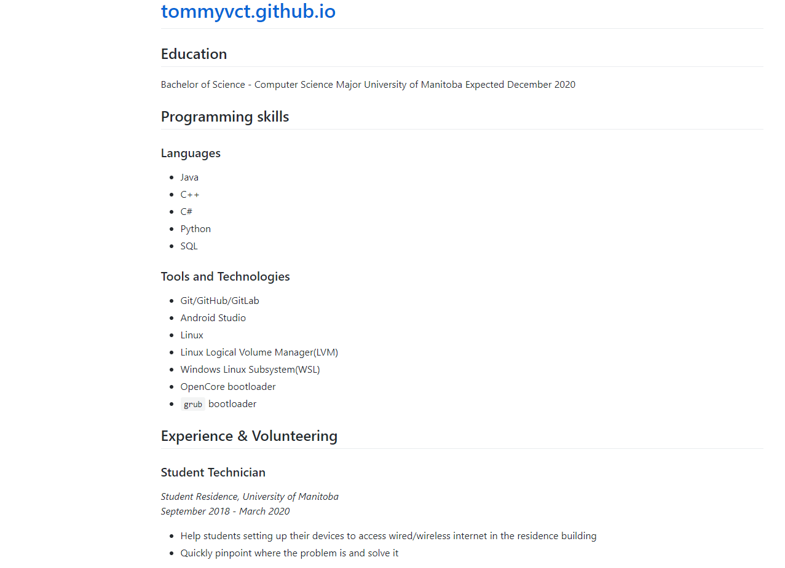
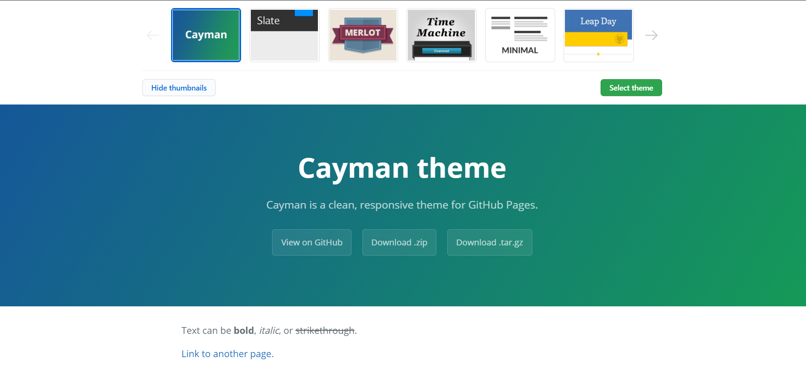
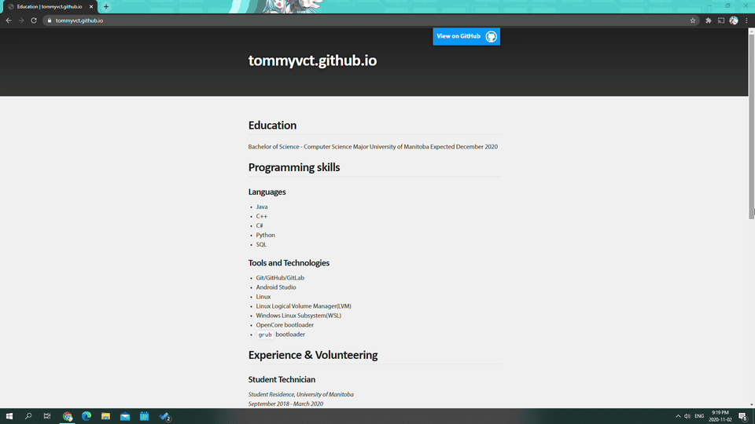

# How to Host Your Resume on GitHub Pages Using Jekyll

## Audience
Computer science students who interested in host their resume on GitHub Pages using Jekyll and Markdown. Knowledge of Git and Jekyll is not required.

## Purpose
This README will describe the practical steps of how to host and format a resume using Markdown, GitHub Pages and Jekyll.

This README also briefly introduces some principles of technical communication.

## Prerequisites
1. GitHub Flavoured Markdown
2. Your resume
3. A free GitHub account
4. A Text Editor  
    > [Visual Studio Code](https://code.visualstudio.com/) is highly recommended

## Instructions

### Create a GitHub repository  
A GitHub Repository is where your resume Markdown file resides.  

> Github utilizes Git, which is a distributed version control system. It enables easy cooperation between different people who work on the same thing. It may not be obvious on this instance of a personal resume, but it shines when multiple people writing documentation together.

1. Start Creating a new repository  
    On the upper-right corner of GitHub, click the `+` icon, then click `New repository`. It will look like this:  
      
2. Name your repository  
    Name it with your GitHub username followed by the domain of GitHub Pages(`.github.io`).
    > Example: `tommyvct.github.io`  
        
3. Configure miscellaneous options  
    Choose `Public` and `Add a README file`  
      
    Then click the green `Create repository` button. This will finish the creatiion of your resume repository.

### Configure this repository for GitHub Pages  
Once we have the repository, you should be able to see the following screen looks like this:  
  
1. Upload your resume  
    Rename your resume as `index.md` first.  
    Click on `Add file`, then `Upload files`.  
    Drag in your resume as indicated, make sure your file is uploaded. It will look like this:  
      
    Then click the green `Commit changes` button. This will add your resume to the repository.
2. Bring GitHub Pages up and running  
    Click on the `Settings` tab, then scroll down to the `GitHub Pages` section. It will look like this:  
      
    As indicated, the website is up and running now.
    Click on the link of your website to have a look.
    It will look like this:  
      
    **It works**! But it looks very basic and some fine-tuning is needed. 

3. Choose a theme  
    > Jekyll itself is a ruby program that converts Markdown documents into `.html` webpages against a set of template, called a "theme".  

    Click on the `Choose a theme` button on the previous step, a list of available themes and examples will be shown like this:  
      
    Choose the one you like and click on `Select theme`.

    > GitHub Pages may bring you to a `README.md` editor after you selected a theme. This file is irrelevant and will not be used by the website. However, as you may already see, it contains helpful information on how to tweak the theme. It is recommended to leave it as-is for future reference.

    We'll be using the `Slate` theme from now on. 
    After choosing a theme, the website will look like this:  
      
    

Congratulations! You've successfully hosted your resume on GitHub Pages!  
  

## More resources

- Fine-tuning your website  
    There are a few things that stand out in the vanilla Slate theme:
    - Blue `View on GitHub` button
    - Default site title of `tommyvct.github.io` 
    - `Published with Github Pages` footer

    We can tweak or remove them.

    As previously mentioned, there should be a `README.md` file been modified when you choose your theme. It contains the basic instruction on how to tweak your theme. The README of the [theme's repository](https://github.com/pages-themes/slate) also serves the same purpose.

    1. Go to the [theme's repository](https://github.com/pages-themes/slate), there is a `_layouts/default.html` file which describes the page layout. Copy it to your repository and delete the unnecessary part.
    2. `_config.yml` contains some important configuration of your website. For example, your website theme and the website title:
        ``` yaml
        theme: jekyll-theme-slate
        title: Tommy Wu
        ```
    More instructions available on [Github Docs](https://docs.github.com/en/free-pro-team@latest/github/working-with-github-pages/about-github-pages-and-jekyll#configuring-jekyll-in-your-github-pages-site).

- [GitHub Flavoured Markdown Cheatsheet](https://guides.github.com/pdfs/markdown-cheatsheet-online.pdf)

- [*Modern Technical Writing* by Andrew Etter](https://www.amazon.ca/gp/product/B01A2QL9SS/ref=ppx_yo_dt_b_d_asin_title_o05?ie=UTF8&psc=1)

## Authors and Acknowledgements
Tommy Wu  
[Slate theme](https://github.com/pages-themes/slate)


## FAQs
### Why is Markdown better than a word processor?
As Andrew Etter stated in his book:
> One of the tenets of modern technical writing is that everyone is a contributor. 

Markdown is a perfect example in terms of simplicity. Essentially it is a plain text file, it is human-readable and easier to work with compared to their offering.

A word processor usually is commercial software that cost quite a fortune, can only be used on Windows and/or macOS, and produces non-human readable products. In a word, it is a barrier to people who want to participate in the documentation.

### Why is my resume not showing up?
1. GitHub Pages will take from a few seconds to a few minutes to deploy your content.
2. Check GitHub Pages settings mentioned in step 2 of [Configure this repository for GitHub Pages](#Configure-this-repository-for-GitHub-Pages). Is the source pointed to the right branch and directory? 
3. Your tweaks to the `_config.yml` and `_layouts/default.html` introduces some syntax errors that Jekyll cannot overcome. Check the file you modified and make sure they are 100% correct. 

### What is Markdown and Jekyll? Why would anyone want it?
Markdown is a simple markup language that is easy to learn, easy to use and human-readable even in its raw format.

Jekyll is a static website generator. It converts your Markdown files into static `.html` files against the theme you choose. It has no server-side application dependencies, no databases or other software need to be installed. 

The combination of both greatly simplifies the process of producing and online publishing documentation, facilitating technical writing.
